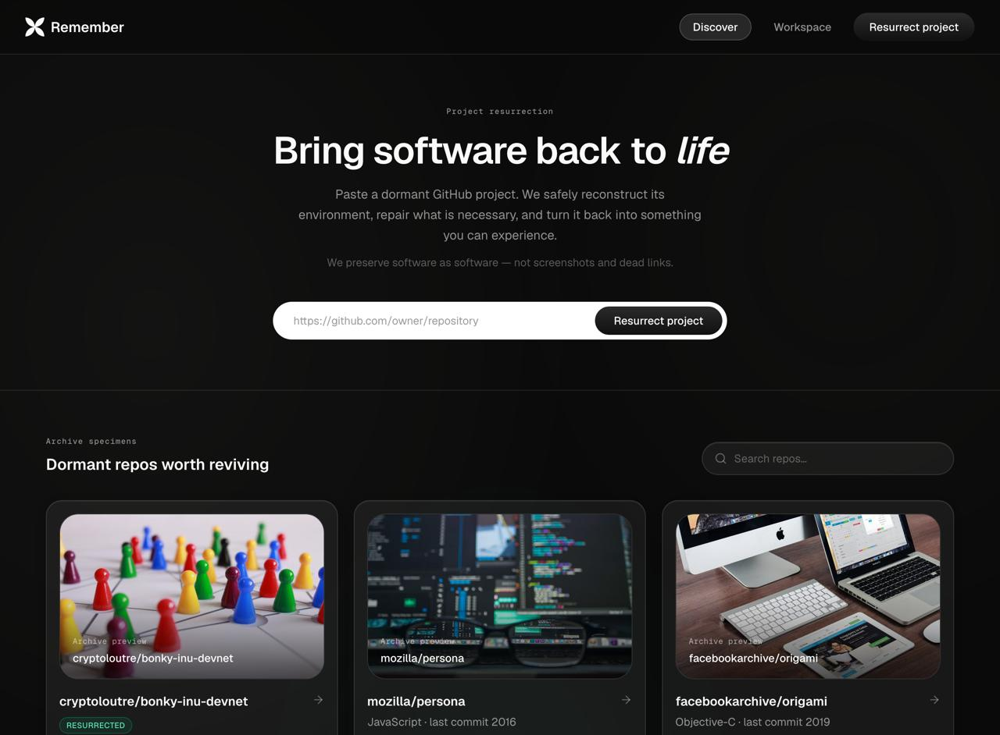
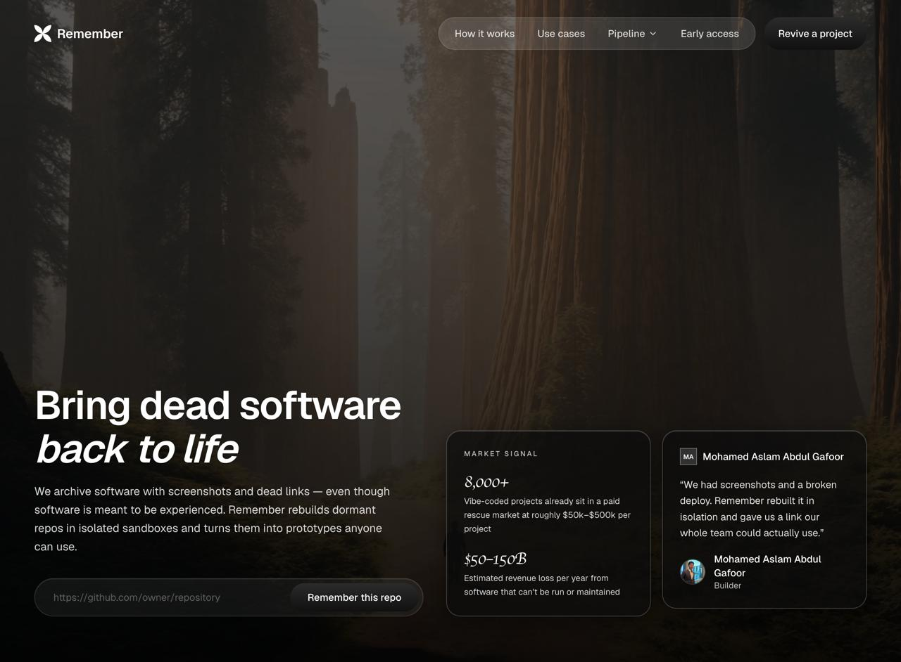
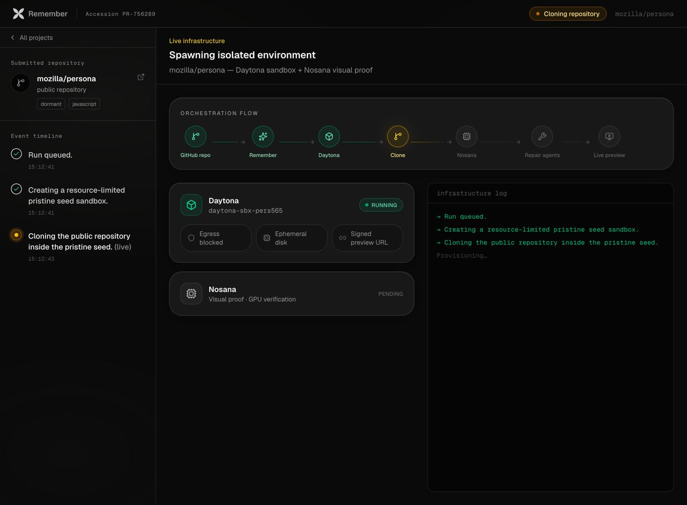
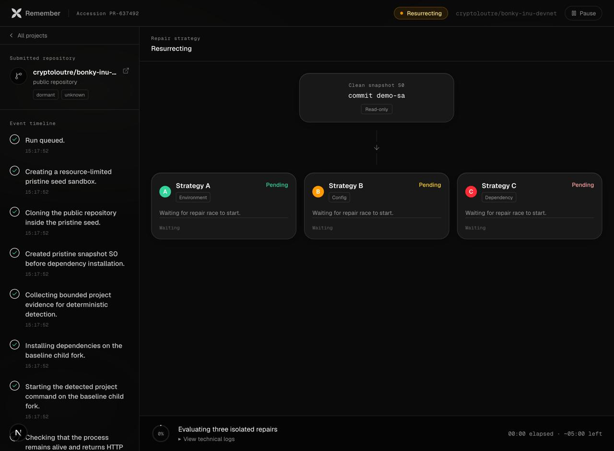
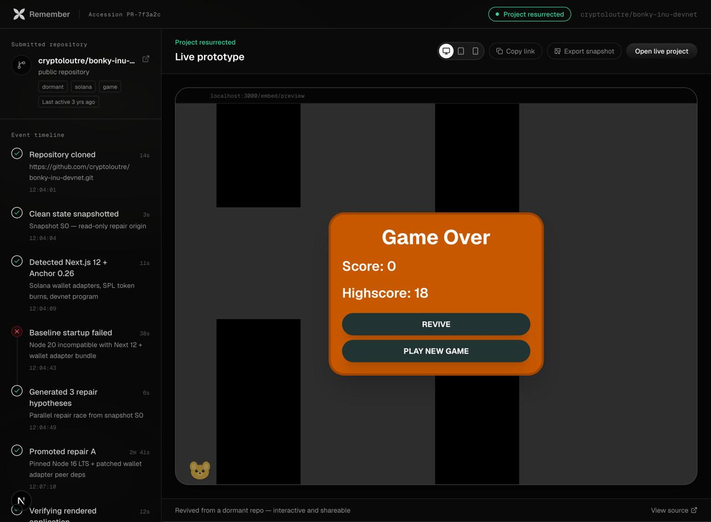
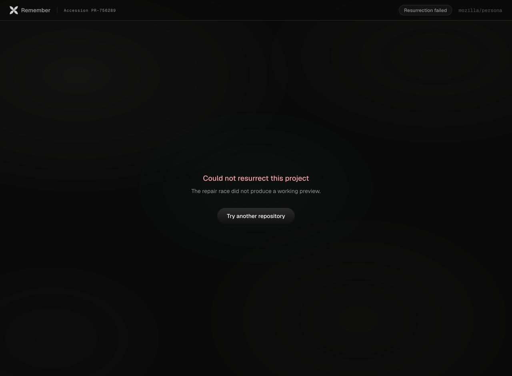
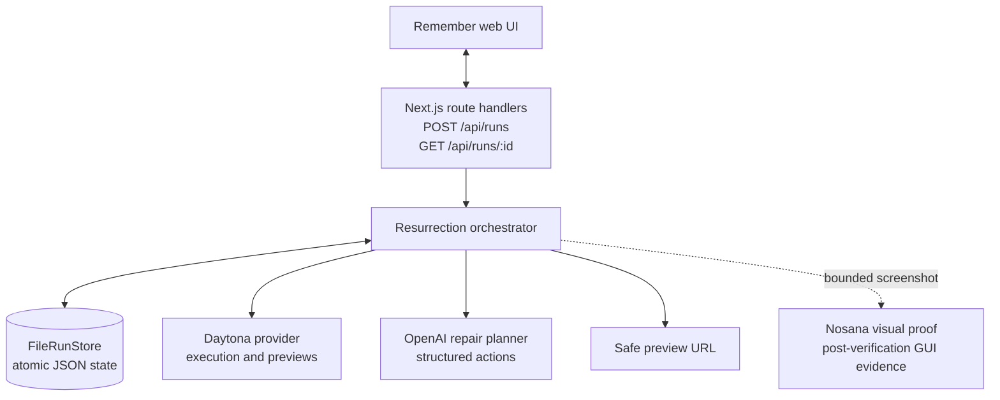

# Remember

Remember brings dormant public GitHub applications back to life. Submit a repository, inspect its structure in an isolated environment, establish a clean baseline, repair the smallest viable set of issues, verify the running result, and return a preview that people can open.

Remember is a production-oriented workflow: Daytona provides the isolated execution
environment, OpenAI provides structured repair planning, and Nosana provides bounded
visual proof for GUI projects after objective verification.

## See Remember in action

These screens show the complete product story: discover a dormant repository, submit it,
watch Daytona and Nosana provision evidence, follow the repair race, and recover
gracefully when a preview cannot be produced.

<p align="center">
  
  
</p>
<p align="center"><em>Discover an archived project, then start a new resurrection from its public GitHub URL.</em></p>

<p align="center">
  
  
</p>
<p align="center"><em>Daytona provisions the isolated seed while Nosana waits for bounded visual verification; three repair strategies can then race from the same snapshot.</em></p>

<p align="center">
  
  
</p>
<p align="center"><em>Successful runs expose a verified preview; unsuccessful runs preserve the evidence without publishing an unsafe link.</em></p>

### Provider responsibilities

| Provider | Dedicated responsibility | Evidence surfaced in the app |
| --- | --- | --- |
| Daytona | Create resource-limited sandboxes, clone repositories, run commands, fork repair candidates, collect logs, and issue signed previews | Sandbox status, isolation controls, process output, and preview URL |
| OpenAI | Convert bounded inspection evidence into structured repair actions | Repair hypotheses, changed files, and candidate strategy metadata |
| Nosana | Run post-verification visual proof for GUI projects | Visual-proof status, classification, and job reference |

### Product flow

```mermaid
flowchart LR
    A[Public GitHub URL] --> B[Validate and canonicalize]
    B --> C[Persist run ID]
    C --> D[Create Daytona sandbox]
    D --> E[Inspect repository]
    E --> F[Preserve pristine seed]
    F --> G[Verify baseline]
    G -->|ready| H[Return verified preview]
    G -->|failed| I[Create three isolated repair candidates]
    I --> J[Execute bounded repairs in parallel]
    J --> K[Verify candidates]
    K --> L[Rank and select winner]
    L --> M[Clean up losers]
    M --> N[Return preview and evidence]
    N -. optional .-> O[Nosana visual proof]
```



### Runtime architecture



### Screens and evidence

| Screen | What it shows | Boundary it makes visible |
| --- | --- | --- |
| Landing | A user can submit a public repository URL | URL validation begins before any provider call |
| Repair race | Three candidates are evaluated independently | Repairs happen in isolated forks of the pristine seed |
| Success | A winner is selected and a preview is available | Verification gates preview publication |
| Project detail | Events, attempts, and evidence are inspectable | Run state is persisted and pollable by run ID |
| No preview | The product can report failure without unsafe links | Preview delivery is fail-closed |

## Product workflow

1. The user submits a public HTTPS GitHub URL.
2. The server validates and canonicalizes the URL.
3. A run is persisted with a stable run ID.
4. A clean sandbox is created and the repository is cloned.
5. The project is inspected using bounded, high-value evidence collection.
6. The runtime profile identifies the language, framework, package manager, install command, start command, and likely ports.
7. The pristine seed is preserved before installation or startup.
8. The baseline is started and verified with process liveness plus HTTP readiness.
9. If the baseline fails, exactly three isolated repair candidates are created and evaluated in parallel.
10. Repair actions are bounded, ordered, and restricted to the repository workspace.
11. Successful candidates are ranked deterministically by preservation and runtime quality.
12. Losing resources are cleaned up, and the run is updated with events, attempts, evidence, and the selected preview.
13. For GUI projects, Nosana classifies one bounded screenshot after objective verification.

### Core boundaries

- `src/lib/contracts/` contains the run, repair, API, and runtime validation contracts.
- `src/lib/resurrection/` contains orchestration, inspection, baseline execution, repair execution, verification, ranking, and cleanup.
- `src/lib/compute/provider.ts` is the provider-neutral sandbox interface.
- `src/lib/daytona/` translates the provider interface to the Daytona SDK.
- `src/lib/openai/` contains the structured repair-planning adapter.
- `src/lib/nosana/` contains the visual-proof/status adapter for GUI evidence.
- `src/lib/store/` persists run state as atomically replaced JSON files.
- `src/lib/server/` composes the production run service from environment configuration.
- `src/remember-frontend/` contains the landing, progress, repair-race, preview, and result UI.

## Requirements

- Node.js compatible with the installed Next.js toolchain.
- npm.
- Daytona and OpenAI credentials for repository execution and repair planning.
- A configured Nosana visual-proof endpoint and API key for GUI evidence.

## Installation

Install the locked project dependencies:

```bash
npm install
```

Create a local environment file:

```bash
cp .env.example .env
```

Never commit `.env`, API keys, wallet files, signed preview URLs, or provider tokens.

## Run Remember locally

Use two terminals.

Start the Next.js application with the required server-side credentials:

```bash
DAYTONA_API_KEY=replace-me \
OPENAI_API_KEY=replace-me \
npm run dev
```

Open [http://localhost:3000](http://localhost:3000), submit a public HTTPS GitHub URL,
and follow the run through inspection, repair, verification, and preview publication.

The server never sends provider credentials to the browser.

Optional Daytona configuration:

```dotenv
DAYTONA_API_URL=
DAYTONA_TARGET=
```

The production service composes a `FileRunStore`, `DaytonaProvider`, `OpenAIRepairPlanner`, and the objective web verifier. If either required provider key is missing, the API remains unavailable instead of guessing or falling back to external services.

### Nosana visual proof

Nosana owns the visual-proof step for GUI projects. It runs after objective process and
HTTP verification, receives only the bounded screenshot reference required by the
configured endpoint, and returns a visual classification and job status:

```dotenv
NOSANA_API_KEY=replace-me
NOSANA_MARKET=
NOSANA_VISUAL_ENDPOINT_URL=https://verified-nosana-endpoint.example/proof
```

Nosana must never receive repository source, secrets, logs containing credentials, or
signed preview tokens. If visual proof is unavailable, the verified application result
remains distinct from the visual-proof result.

## Environment variables

| Variable | Purpose | Required |
|---|---|---|
| `PROJECT_RESURRECTION_RUN_DIR` | Directory for per-run JSON state | No; OS temp directory is used |
| `PROJECT_RESURRECTION_PREVIEW_URL` | Preview URL returned after success | No |
| `NEXT_PUBLIC_PROJECT_RESURRECTION_PREVIEW_URL` | Browser iframe preview target | No |
| `DAYTONA_API_KEY` | Daytona server credential | Required |
| `DAYTONA_API_URL` | Optional Daytona API URL override | No |
| `DAYTONA_TARGET` | Optional Daytona target/region | No |
| `OPENAI_API_KEY` | OpenAI server credential for repair planning | Required |
| `OPENAI_REPAIR_MODEL` | OpenAI model used for repair planning | No; defaults to `gpt-5.6-sol` |
| `NOSANA_API_KEY` | Nosana server credential | Visual proof only |
| `NOSANA_MARKET` | Optional Nosana market selection | Visual proof only |
| `NOSANA_VISUAL_ENDPOINT_URL` | Verified visual-proof endpoint | Visual proof only |
| `GITHUB_TOKEN` | Optional GitHub helper credential | No |

## API

### `POST /api/runs`

Creates a run and starts background processing.

Request:

```json
{
  "repoUrl": "https://github.com/owner/repository"
}
```

Responses:

- `202` — `{ "id": "run_<uuid>" }`
- `400` — malformed JSON, invalid fields, or unsupported repository URL
- `500` — unexpected server or persistence failure
- `503` — no valid runtime composition is configured

### `GET /api/runs/:id`

Returns the atomically persisted run snapshot.

Responses:

- `200` — run state and progress data
- `404` — invalid or unknown run ID
- `500` — persistence failure

The response is sent with `Cache-Control: no-store` because the frontend polls it while work progresses.

## Safety model

- Only public HTTPS GitHub repository URLs are accepted.
- Sandbox paths are resolved under the repository root and reject traversal, absolute paths, drive paths, and NUL bytes.
- Repository evidence is allowlisted and bounded by file and aggregate byte limits.
- Commands, writes, replacements, action counts, command lengths, and command timeouts are bounded.
- Repair work runs in isolated forks of a pristine seed.
- The browser receives run state and safe preview links, never provider credentials.
- OpenAI and Nosana adapters are server-only.
- External evidence URLs are accepted only when they pass the adapter’s HTTPS safety checks.
- Provider commands are submitted through `ComputeProvider`; the host is not used as the repository execution environment.

## Verification commands

Run the available project checks:

```bash
npm run lint
npm run build
```

Before a production release, also run strict TypeScript checks, a browser smoke test,
real Daytona sandbox cases, Nosana visual-proof cases, and independent cleanup
verification.

## Troubleshooting

### The API returns `503`

Provide both `DAYTONA_API_KEY` and `OPENAI_API_KEY`, then restart the Next.js process
after changing `.env`.

### The preview is unavailable

Confirm the Daytona sandbox is running the detected start command, the configured port
is reachable, and the signed preview URL has not expired. A verified core run may
intentionally have no visual-proof result.

### A run appears stuck

Inspect the JSON file under `PROJECT_RESURRECTION_RUN_DIR` or the OS temporary run
directory. Check Daytona sandbox availability, process logs, configured ports, and
Nosana endpoint responses without printing secrets or signed URLs.

## Current delivery boundary

Remember’s production path is implemented around explicit server-side provider
boundaries: Daytona handles isolated execution and previews, OpenAI plans bounded
repairs, and Nosana handles post-verification visual proof. Credentials, provider
endpoint configuration, integration coverage, and independent cleanup verification are
required before deployment.

## Contribution

Keep changes narrowly scoped to the owning layer. Preserve the provider interfaces, safety limits, API contract, and server-only secret boundary. Run the relevant checks and document any deferred live verification in the handoff before merging.
